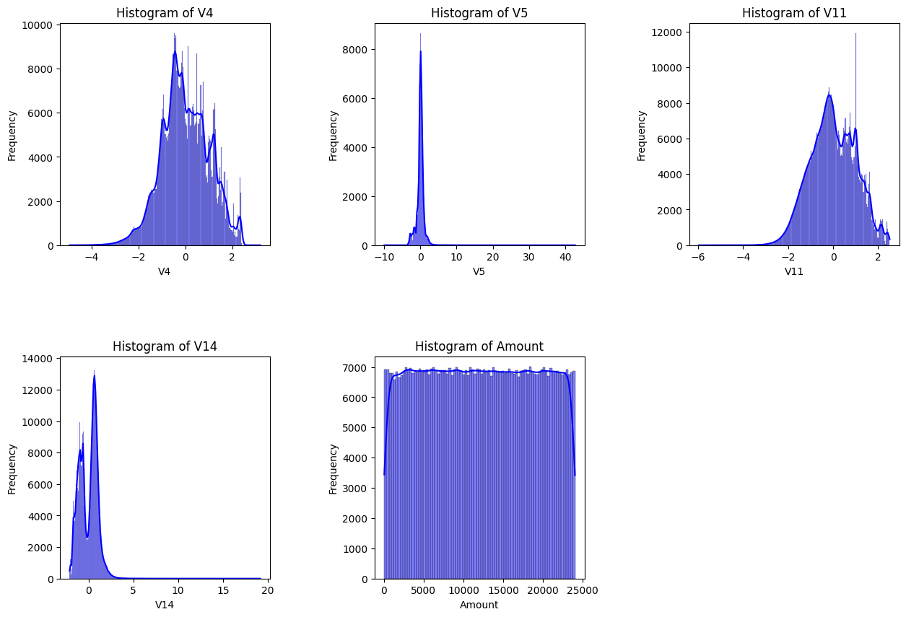
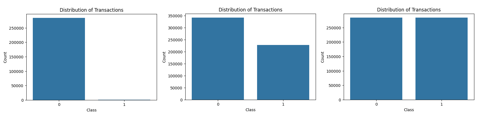
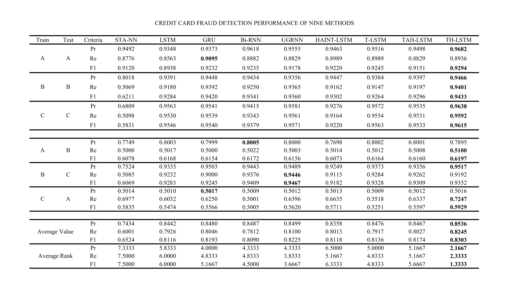

# fraud-detection-thlstm
Implementation of the TH-LSTM model from the paper "Learning Transactional Behavioral Representations for Credit Card Fraud Detection"

## Dataset Analysis
In the paper, the authors mention the use of **two main datasets**:
- The first is a large real-world transaction dataset provided by a financial institution of China, containing 5.12 million online transaction records from 107,192 users, including 4.98 million legitimate transactions and 0.14 million fraudulent ones.
- The second is a public dataset containing 284,807 transactions made by European cardholders in 2013.

However, the first dataset, provided by a financial institution of China, is not something I can easily access. Therefore, in this repository, I use **three public datasets** instead:
- Dataset A (https://www.kaggle.com/datasets/mlg-ulb/creditcardfraud): Contains transactions made by credit cards in September 2013 by European cardholders
- Dataset B (https://www.kaggle.com/datasets/williamsousarj/credit-card-fraud-detection-dataset-2023-new)
- Dataset C (https://www.kaggle.com/datasets/nelgiriyewithana/credit-card-fraud-detection-dataset-2023): Contains credit card transactions made by European cardholders in the year 2023

All three public datasets have been **anonymized** to **protect the cardholders' identities**. I will **focus** on analyzing **one of the three** datasets, specifically dataset C:

### Load Dataset & Get Overview of the Data
```python
from data.preprocessing import Data

data = Data('dataC/path')
data.overview()
```
```
                 id        V1        V2        V3        V4        V5        V6        V7        V8        V9  ...  
              0   0 -0.260648 -0.469648  2.496266 -0.083724  0.129681  0.732898  0.519014 -0.130006  0.727159  ...
              1   1  0.985100 -0.356045  0.558056 -0.429654  0.277140  0.428605  0.406466 -0.133118  0.347452  ...  
              2   2 -0.260272 -0.949385  1.728538 -0.457986  0.074062  1.419481  0.743511 -0.095576 -0.261297  ...  
              3   3 -0.152152 -0.508959  1.746840 -1.090178  0.249486  1.143312  0.518269 -0.065130 -0.205698  ...  
              4   4 -0.206820 -0.165280  1.527053 -0.448293  0.106125  0.530549  0.658849 -0.212660  1.049921  ...  
```

### Significant Variables

Based on the **logistic regression**, the **Z-scores** for the coefficients of the variables `V1` through `V28`(excluding `V5` and `Amount`) are all greater than 2 in absolute terms. This indicates that these variables have a **relatively strong** and **statistically significant** impact on predicting the `Class`. 

In particular, `V4` (coef = 3.6329), `V14` (coef = -3.3569), and `V11` (coef = 1.8757) have the highest Z-scores, implying they are the **most important predictors**. `V5` (coef = -0.0153) and `Amount` (coef ≈ -7.252e-08) have Z-scores with magnitudes less than 2, suggesting that these variables have a **weaker impact** or **potentially** no significant predictive contribution in determining `Class`.

```python
data.significant_var()
```
```
                                Generalized Linear Model Regression Results                  
                ==============================================================================
                Dep. Variable:                  Class   No. Observations:               568630
                Model:                            GLM   Df Residuals:                   568600
                Model Family:                Binomial   Df Model:                           29
                Link Function:                  Logit   Scale:                          1.0000
                Method:                          IRLS   Log-Likelihood:                -53585.
                Date:                Sun, 09 Feb 2025   Deviance:                   1.0717e+05
                Time:                        15:46:12   Pearson chi2:                 7.82e+16
                No. Iterations:                    13   Pseudo R-squ. (CS):             0.6981
                Covariance Type:            nonrobust                                         
                ==============================================================================
                                coef    std err          z      P>|z|      [0.025      0.975]
                ------------------------------------------------------------------------------
                Intercept      9.0810      0.084    108.499      0.000       8.917       9.245
                V1            -0.6880      0.019    -36.668      0.000      -0.725      -0.651
                V2             0.1582      0.016      9.703      0.000       0.126       0.190
                V3            -1.1804      0.020    -59.558      0.000      -1.219      -1.142
                V4             3.6329      0.027    136.191      0.000       3.581       3.685
                V5            -0.0153      0.014     -1.057      0.290      -0.044       0.013
                V6            -0.4789      0.017    -28.909      0.000      -0.511      -0.446
                V7            -1.1092      0.026    -42.289      0.000      -1.161      -1.058
                V8            -2.8335      0.045    -63.570      0.000      -2.921      -2.746
                V9            -0.4779      0.022    -21.598      0.000      -0.521      -0.435
                V10           -1.8979      0.031    -60.689      0.000      -1.959      -1.837
                V11            1.8757      0.018    103.216      0.000       1.840       1.911
                V12           -2.8171      0.026   -109.223      0.000      -2.868      -2.767
                V13            0.0176      0.009      2.014      0.044       0.000       0.035
                V14           -3.3569      0.026   -127.275      0.000      -3.409      -3.305
                V15           -0.2418      0.009    -27.972      0.000      -0.259      -0.225
                V16           -0.8542      0.024    -35.459      0.000      -0.901      -0.807
                V17           -1.9342      0.027    -71.811      0.000      -1.987      -1.881
                V18           -0.9296      0.021    -45.195      0.000      -0.970      -0.889
                V19           -0.0804      0.012     -6.443      0.000      -0.105      -0.056
                V20            0.1328      0.012     10.902      0.000       0.109       0.157
                V21            0.2487      0.028      8.737      0.000       0.193       0.304
                V22            0.4401      0.015     29.085      0.000       0.410       0.470
                V23           -0.3412      0.011    -31.866      0.000      -0.362      -0.320
                V24           -0.1660      0.009    -18.049      0.000      -0.184      -0.148
                V25            0.1617      0.011     14.900      0.000       0.140       0.183
                V26           -0.1069      0.010    -10.920      0.000      -0.126      -0.088
                V27            0.1873      0.022      8.642      0.000       0.145       0.230
                V28            0.1534      0.011     14.578      0.000       0.133       0.174
                Amount     -7.252e-08   1.17e-06     -0.062      0.950   -2.36e-06    2.22e-06
                ==============================================================================
```

### Distribution of V4, V5, V11, V14 and Amount
```python
data.histogram_distribution(columns_to_plot=['V4', 'V5', 'V11', 'V14', 'Amount'])
```



### Distribution of Fraudulent Transactions
We will look at the distribution of fraudulent transactions across all three datasets A, B and C respectively

```python
data.fraud_transactions_distribution()
```



From left to right, dataset A is **highly imbalanced**, with the positive class (frauds) accounting for only **0.172%** of all transactions; dataset B is still **imbalanced** but significantly less so than dataset A, with class 1 (frauds) transactions making up a **larger proportion** (40.02%); and dataset C is **perfectly balanced**, with equal numbers of fraud and non-fraud transactions (50-50)

## Proposed Model Analysis

The proposed **TH_LSTM (Transaction History LSTM)** model is designed for credit card fraud detection by leveraging transactional behavioral representations. It **utilizes** a Long Short-Term Memory (LSTM) network to **capture sequential dependencies** in a user's transaction history. The model processes transactional data over time, learning patterns in spending behavior to distinguish between legitimate and fraudulent activities. By **incorporating** temporal dynamics and behavioral profiling, TH_LSTM aims to **improve** fraud detection accuracy while **reducing false positives**

### Overview
```python
from models.th_lstm import TH_LSTM

model = TH_LSTM(input_dim, hidden_dim, output_dim)
print(model)
```
```
TH_LSTM(
  (time_gate): TimeAwareGate(
    (W_gamma): Linear(in_features=1, out_features=64, bias=True)
  )
  (lstm): LSTMCell(29, 64)
  (dropout): Dropout(p=0.8, inplace=False)
  (attention): HistoricalAttention(
    (W_h): Linear(in_features=64, out_features=64, bias=True)
    (W_c): Linear(in_features=64, out_features=64, bias=True)
    (v): Linear(in_features=64, out_features=1, bias=True)
  )
  (fc): Linear(in_features=128, out_features=2, bias=True)
)
```

### How the Model work
The proposed TH-LSTM model **extends** the **standard LSTM architecture** by incorporating several **key components**, which are detailed further in the paper.  Here is some basic information about these components:
#### Time-Aware Gate
TH-LSTM introduces a **time-aware gate** of the recurrent unit. At each time step, a time-aware gate receives its previous hidden state information, the current transaction and the time interval between the current and previous transactions of a user, and interacts with other control gates

#### Current-Historical Attention Module
TH-LSTM further augments the LSTM by **adding** an **attention mechanism** that builds **explicit connections** between the current transaction and a window of historical transactions. This attention mechanism **highlights** which previous transactions are most **relevant** to the current one, enabling the model to capture **periodicity** and **repeated behavioral patterns**

#### Interaction Module
Finally, the model **fuses** the information from the candidate hidden state, the attention-derived context vector, and the original transactional features (obtained via a transactional expansion) through an **interaction module**

## Experimental Setup
### Benchmark Methods
For the **original research paper**, the authors employed **11 models** on a private dataset and **8 models** on a public dataset to establish a baseline for evaluating proposed model

This repository will implement 8 of those models for comparison: **STA-NN**, **LSTM**, **GRU**, **Bi-RNN**, **UGRNN**, **HAINT-LSTM**, **T-LSTM**, and **TAH-LSTM**

### Data Partition
With **three datasets** A, B, and C, we will use them in **two ways**:

In the first approach, **each dataset** is split into an **8:2 ratio** for both training and testing

Then, we **sequentially** use A for training and test on B, use B for training and test on C, and finally, use C for training and test on A.

### Parameter Settings
In this repository, the size of mini-batch is set to **1000**. The number of units in models and training epochs are set to **64** and **100**, respectively. The number of transactional features is **29**. Besides, the dropout technique is used to prevent over-fitting and the dropout ratio is set to **0.8**. The learning rate in **Adam optimization** algorithm is set to **0.001**.

### Results
TH-LSTM **outperforms** all other models in terms of **overall performance**, with the **highest** scores across all metrics and the **best** average rank



